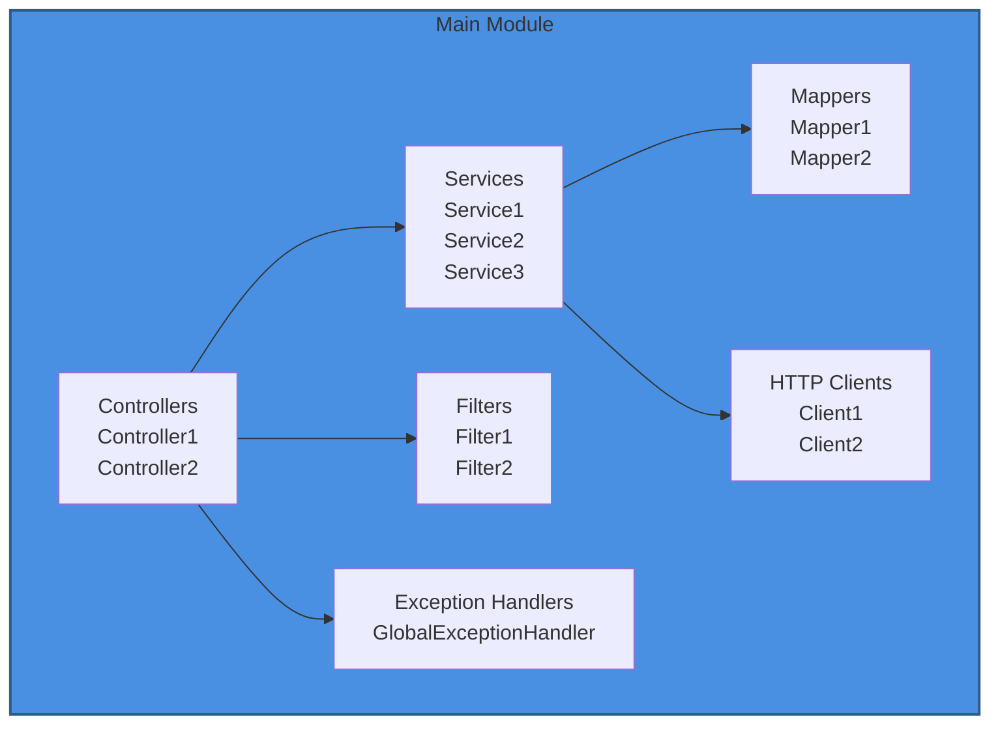

# Architecture Templates (C4 Model)

Create one file per C4 level in `docs/architecture/`.

---

## Level 1: System Context (`system-context.md`)

```markdown
# System Context Diagram

## Overview
C4 Model Level 1: System Context showing {Service Name} and external systems.

## System Context Diagram

```mermaid
graph TB
    Users[End Users<br/>Web/Mobile/TV Clients]
    Service[{Service Name}]

    subgraph External_Systems[External Microservices]
        Svc1[service-1-name]
        Svc2[service-2-name]
    end

    subgraph Cloud[Cloud Services]
        Store[Storage<br/>S3/GCS/Blob]
        Cache[Cache<br/>Redis/Memcached]
        DB[(Database<br/>Postgres/MySQL/Mongo)]
    end

    Users -->|HTTPS: API Calls| Service
    Service -->|HTTP: Purpose| Svc1
    Service -->|HTTP: Purpose| Svc2
    Service -->|API: Read/Write| Store
    Service -->|TCP: Cache| Cache
    Service -->|TCP: Query| DB

    style Service fill:#4A90E2,stroke:#2E5C8A,stroke-width:3px,color:#fff
    style External_Systems fill:#F5F5F5,stroke:#999
    style Cloud fill:#FF9900,stroke:#CC7A00
```

## System Responsibilities

### {Service Name}
- {Responsibility 1}
- {Responsibility 2}

### External Systems
- **service-1**: {purpose}
- **service-2**: {purpose}

## Communication
- **Protocol**: {HTTP/gRPC/WebSocket}
- **Formats**: {JSON/XML/Protobuf}
- **Timeouts**: {connection}ms connection, {read}ms read
- **Security**: {mTLS/API keys/OAuth}

---

**Last Updated:** YYYY-MM-DD
**C4 Level:** 1 - System Context
```

---

## Level 2: Container Diagram (`container-diagram.md`)

```markdown
# Container Diagram

## Overview
C4 Model Level 2: Container view showing technology choices and module boundaries.

## Container Diagram

```mermaid
graph TB
    subgraph System[{Service Name}]
        API[API Module<br/>Spring Boot / Express / FastAPI]
        Common[Common Module<br/>Shared Models & Utils]
        Client[Client Module<br/>SDK for Consumers]
    end

    subgraph External[External Systems]
        ExtSvc[External Service]
        DB[(Database)]
        Cache[(Cache)]
    end

    API --> Common
    Client --> Common
    API --> ExtSvc
    API --> DB
    API --> Cache

    style System fill:#E3F2FD,stroke:#2196F3,stroke-width:2px
    style API fill:#4A90E2,stroke:#2E5C8A,stroke-width:2px,color:#fff
```

## Containers

| Container | Technology | Purpose |
|-----------|-----------|---------|
| API Module | {framework} | REST endpoints and business logic |
| Common Module | {language} | Shared models, validators, utilities |
| Client Module | {language} | SDK for external consumers |

## Inter-Container Communication
- API → Common: Compile-time dependency (models, validators)
- Client → Common: Compile-time dependency (shared DTOs)

---

**Last Updated:** YYYY-MM-DD
**C4 Level:** 2 - Container
```

---

## Level 3: Component Diagram (`component-diagram.md`)

```markdown
# Component Diagram

## Overview
C4 Model Level 3: Component view showing internal structure of the main container.

## Component Diagram



## Components

### Controllers
- {ControllerName}: {purpose}

### Services
- {ServiceName}: {purpose}

### Mappers
- {MapperName}: {purpose}

### HTTP Clients
- {ClientName}: {purpose, target service}

### Cross-Cutting
- Filters: {list}
- Exception Handlers: {list}

---

**Last Updated:** YYYY-MM-DD
**C4 Level:** 3 - Component
```

---

## Level 4: Deployment Diagram (`deployment-diagram.md`)

```markdown
# Deployment Diagram

## Overview
C4 Model Level 4: Deployment view showing cloud regions, clusters, and runtime topology.

## Deployment Diagram

```mermaid
graph TB
    Users[End Users] -->|HTTPS| DNS[DNS / CDN]

    DNS -->|Route| Region1[Cloud Region 1]
    DNS -->|Route| Region2[Cloud Region 2]

    subgraph Region1[Region: {region-1}]
        LB1[Load Balancer]
        Cluster1[K8s / ECS Cluster]
        Store1[Storage]
    end

    subgraph Region2[Region: {region-2}]
        LB2[Load Balancer]
        Cluster2[K8s / ECS Cluster]
    end

    LB1 --> Cluster1
    LB2 --> Cluster2
    Cluster1 --> Store1

    style Region1 fill:#FFE0B2,stroke:#FF9800,stroke-width:2px
    style Region2 fill:#FFE0B2,stroke:#FF9800,stroke-width:2px
```

## Deployment Details

### Regions
- **{region-1}**: Primary ({environments})
- **{region-2}**: Secondary ({environments})

### Infrastructure
- **DNS**: {routing strategy}
- **Load Balancer**: {health check path}
- **Cluster**: {type, scaling}
- **Storage**: {buckets, databases}

### Container Specs
- **Base**: {runtime}
- **App**: {framework} executable
- **Port**: {port}
- **Health**: {health endpoints}

### Environments

| Env | Purpose | Regions | Replicas |
|-----|---------|---------|----------|
| prod | Production | {regions} | {count} |
| qa | Testing | {regions} | {count} |
| dev | Development | {regions} | {count} |

### Security
- {Network security}
- {Service mesh}
- {IAM}

### Observability
- {Logging}
- {Tracing}
- {Metrics}

---

**Last Updated:** YYYY-MM-DD
**C4 Level:** 4 - Deployment
**Cloud:** {provider}
```

## Guidelines

1. **Extract from actual files**: Read Terraform, K8s manifests, Dockerfiles, and config YAMLs
2. **Style nodes**: Use `style` directives to color-code the main service, external systems, and cloud resources
3. **Show protocols**: Label edges with protocols (HTTP, gRPC, TCP, S3 API)
4. **Only document real systems**: Every box in the diagram must correspond to actual code or config
