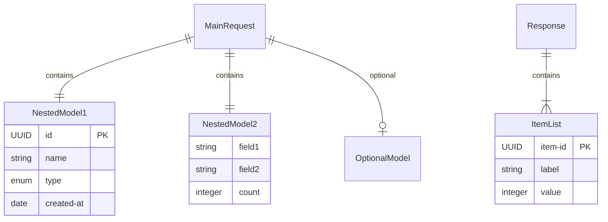

# Data Model Templates

Create files in `docs/data-models/`.

---

## Request Models (`request-models.md`)

```markdown
# Request Models

## Overview
Comprehensive documentation of all request DTOs with field descriptions, validation rules, and sample values.

## {Endpoint Group} Request Models

### {ModelClassName}
**Package**: `{full.package.name}`
**Purpose**: {one-line description}

**Fields**:
- `fieldName` (Type, required/optional): Description
- `nestedObject` (ObjectType, required): Description
  - `nestedObject.childField` (Type): Description

**Validations**:
- `@NotNull`: {which fields}
- `@Valid`: Cascade to {nested objects}
- `@CustomValidator`: {description of custom validation}

### {NestedModelClassName}
**Package**: `{full.package.name}`
**Purpose**: {one-line description}

**Fields**:
- `field1` (Type, required): Description
- `field2` (Type, optional): Description

## Enumerations

### {EnumName} (Enum)
Values: `VALUE_1`, `VALUE_2`, `VALUE_3`

## Sample Request Values

### {ModelName} Example
<details>
<summary>Click to expand</summary>

```json
{
  "fieldName": "realistic-value",
  "nestedObject": {
    "childField": "value"
  }
}
```
</details>

## Validation Summary

### Custom Validators
- **@ValidatorName**: {what it validates}

### Standard Validators
- **@NotNull**: Field must be present
- **@Valid**: Cascade validation to nested objects
- **@Positive**: Number must be positive

## Cross-References
- [API Contracts](../api-contracts/) - Request examples in context
- [Data Model ER Diagram](./data-model-er-diagram.md) - Visual relationships
- [Response Models](./response-models.md) - Output DTOs

---

**Last Updated:** YYYY-MM-DD
**Total Request Models**: {count}
**Custom Validators**: {count}
```

---

## Response Models (`response-models.md`)

Same structure as request models but for response DTOs. Include:
- Success response models
- Error response models
- Wrapper/envelope models

---

## ER Diagram (`data-model-er-diagram.md`)

```markdown
# Data Model ER Diagram

## Overview
Entity relationship diagram showing data model relationships, composition hierarchies, and data flow transformations.

## ER Diagram



## Model Relationships

### Request Models Hierarchy
**MainRequest** (Root)
- ← NestedModel1 (1:1, required)
- ← NestedModel2 (1:1, required)
- ← OptionalModel (1:0..1, optional)

### Response Models Hierarchy
**MainResponse** (Root)
- ← ItemList (1:N, array)

## Composition Patterns

### Aggregation (Loose Coupling)
- {Description of loosely coupled relationships}

### Composition (Strong Coupling)
- {Description of tightly coupled relationships}

### Optional Relationships
- {Description of optional/conditional relationships}

## Data Flow Transformations

### Request → External Service → Response

```
IncomingRequest
  ↓ (MapperClassName)
ExternalServiceRequest
  ↓ (External Service Call)
ExternalServiceResponse
  ↓ (Response Construction)
OutgoingResponse
```

## Key Field Types

### Identifiers
- UUID: {list of UUID fields}
- String: {list of string ID fields}

### Enumerations
- {Enum1}, {Enum2}, {Enum3}

### Temporal
- Date: {date fields}
- Duration: {duration fields}

### Collections
- List<{Type}>: {fields}
- Map<{K}, {V}>: {fields}

## Cross-References
- [Request Models](./request-models.md)
- [Response Models](./response-models.md)
- [Data Lineage](../data-lineage/data-lineage-graph.md)

---

**Last Updated:** YYYY-MM-DD
**Total Entities**: {count}
**Relationship Types**: Aggregation, Composition, Optional
```

## Guidelines

1. **Read model classes**: Extract every field, annotation, and type from actual DTOs
2. **Identify relationships**: Map `@Valid`, nested objects, collections to ER diagram
3. **Document enums**: List every enum with all values
4. **Show transformations**: Map how data flows from request → mapper → external → response
5. **Use realistic examples**: Pull from test fixtures or sample request files
