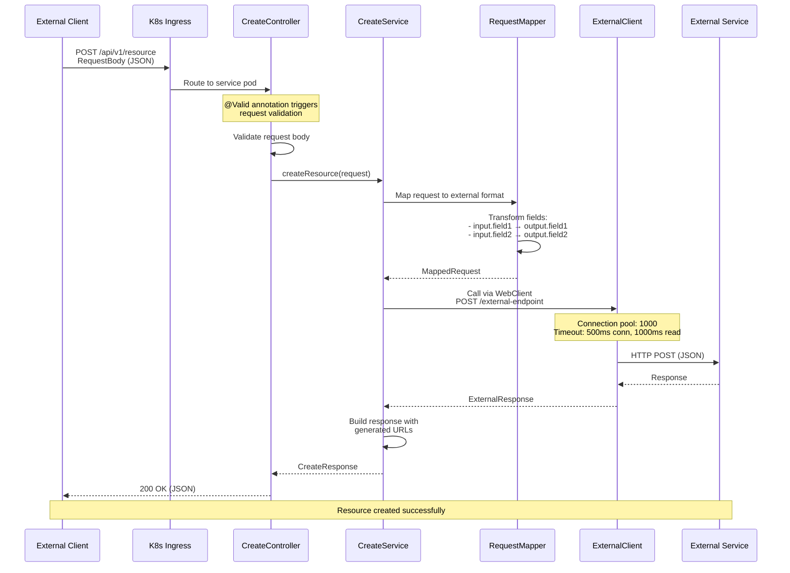
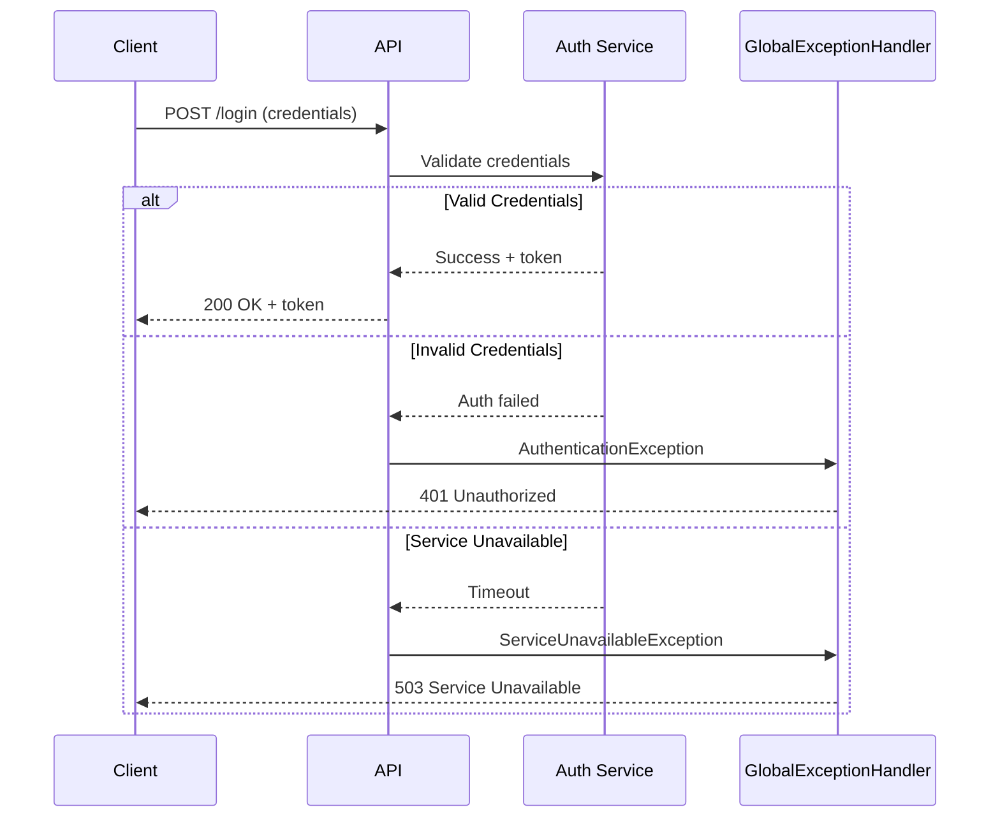
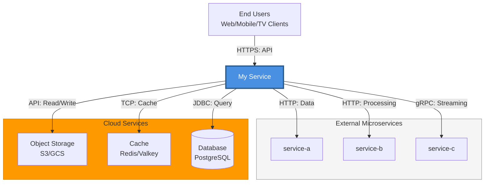
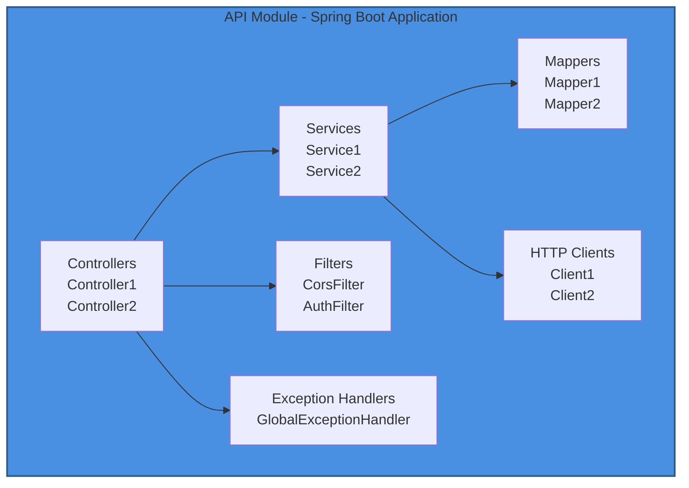
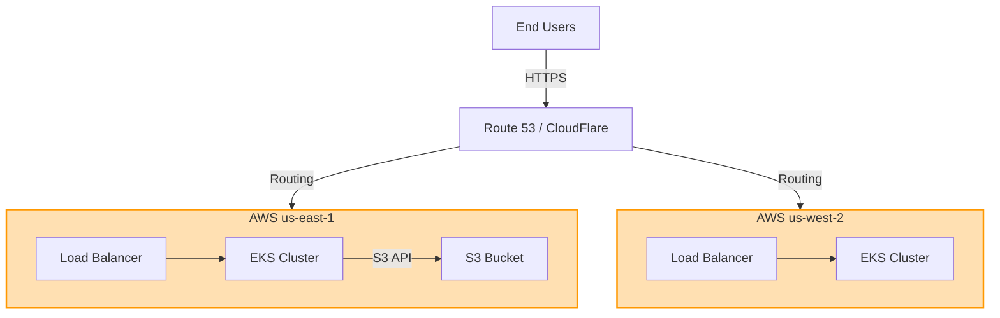
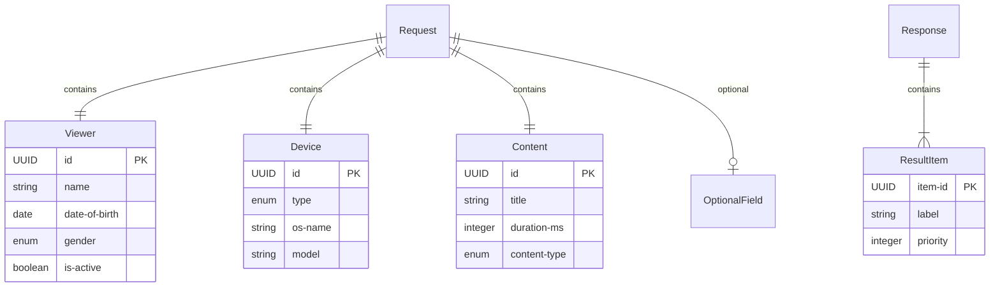
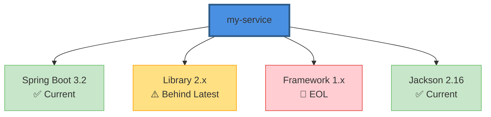
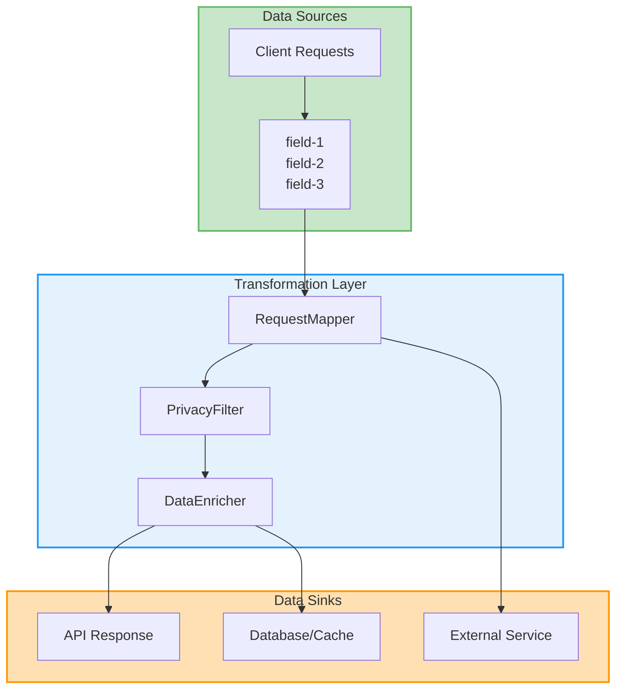
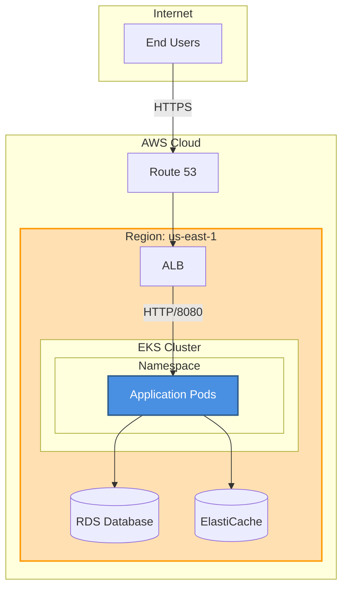
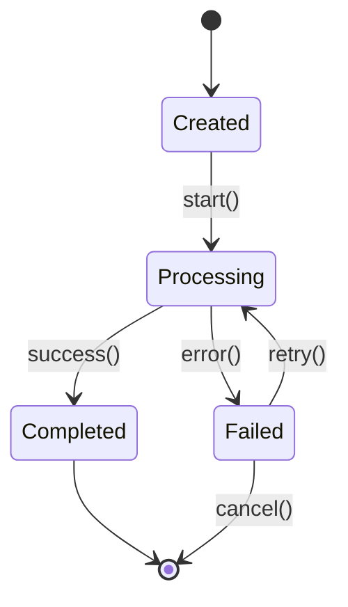

# Mermaid Diagram Examples

## Sequence Diagram - API Request Flow

## Sequence Diagram - Error Handling with Alt Blocks

## C4 System Context Diagram (Styled)

## Component Diagram

## Deployment Diagram (Multi-Region)

## ER Diagram

## Dependency Graph with Risk Indicators

## Data Lineage Flowchart

## Infrastructure Topology

## State Diagram

## Styling Tips

- Use `fill` for background color, `stroke` for border
- Use `stroke-width` to emphasize important nodes
- Color palette:
  - Primary service: `#4A90E2` (blue)
  - External systems: `#F5F5F5` (light gray)
  - Cloud services: `#FF9900` (orange)
  - Success/current: `#C8E6C9` (green)
  - Warning/behind: `#FFE082` (yellow)
  - Error/EOL: `#FFCDD2` (red)
  - Info/IAM: `#E1F5FE` (light blue)
  - Transform: `#E3F2FD` (blue tint)
  - Data IN: `#C8E6C9` (green tint)
  - Data OUT: `#FFE0B2` (orange tint)
