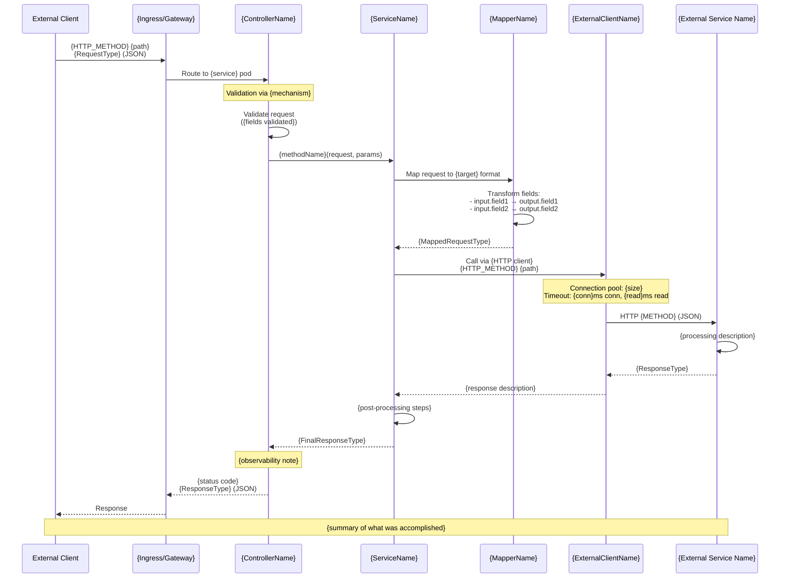
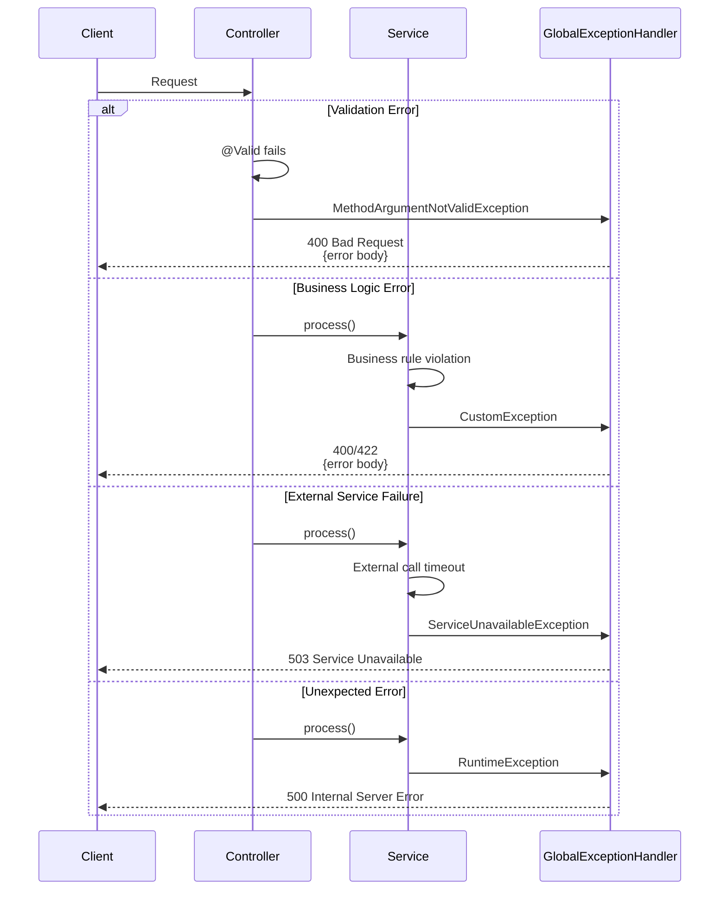
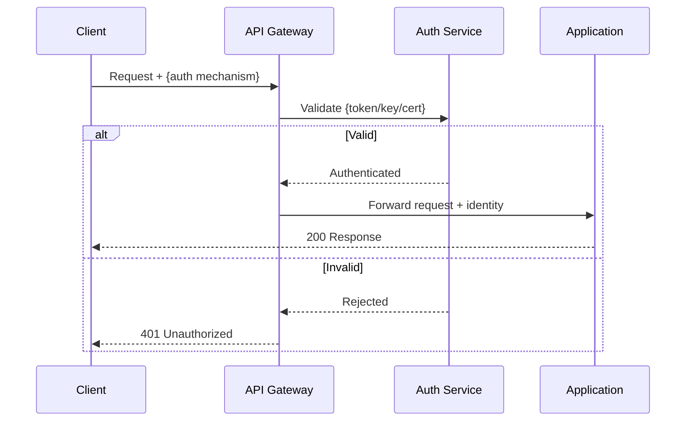

# Sequence Diagram Templates

Create one file per major flow in `docs/sequence-diagrams/`.

## File Naming Convention

`{NN}-{flow-name}.md`

Use numeric prefix for ordering: `01-create-flow.md`, `02-get-flow.md`, `03-update-flow.md`.

For supplementary flows: `authentication-flow.md`, `error-handling-flow.md`.

---

## Template

```markdown
# {Flow Name}



## Flow Description

### 1. Request Reception
- Client sends {method} request with {payload description}
- Request routed through {ingress/gateway} to service

### 2. Request Validation
- {Validation mechanism} triggers validation
- Validators check:
  - {validation rule 1}
  - {validation rule 2}

### 3. Business Logic
- {Service} orchestrates the operation
- Steps:
  1. {step 1}
  2. {step 2}

### 4. External Service Call
- {Client} calls {external service} via {protocol}
- Configuration: {connection pool, timeouts}

### 5. Response Construction
- {How response is built}
- {Any enrichment or URL construction}

### 6. Response Delivery
- {Final response format and delivery}

## Error Handling

| Error | HTTP Code | Cause | Handling |
|-------|-----------|-------|----------|
| Validation Error | 400 | {cause} | {how handled} |
| Service Unavailable | 503 | {cause} | {how handled} |
| Internal Error | 500 | {cause} | {how handled} |

## Performance Characteristics

- **Typical Latency**: {range}ms
- **Connection Pooling**: {pool size, reuse strategy}
- **Timeout Protection**: {total timeout}ms
- **Async Processing**: {sync/async details}

## Monitoring & Observability

- **Distributed Tracing**: {tracing mechanism and sampler}
- **Metrics**: {what metrics are collected}
- **Log Correlation**: {request ID tracking}
```

---

## Error Handling Flow Template

For documenting the global error handling flow:

```markdown
# Error Handling Flow



## Error Categories

### Validation Errors (4xx)
- {error type}: {description}

### Business Errors (4xx)
- {error type}: {description}

### Infrastructure Errors (5xx)
- {error type}: {description}

## Error Response Format

```json
{
  "errorCode": "string",
  "message": "string",
  "timestamp": "ISO-8601"
}
```
```

---

## Authentication Flow Template *(if applicable)*

```markdown
# Authentication Flow


```

## Guidelines

1. **Read the actual code**: Trace from controller → service → mapper → external client for each flow
2. **Name participants after real classes**: Use actual class names from the codebase
3. **Show real field transformations**: In the Mapper participant, list actual field mappings
4. **Include configuration details**: Show timeouts, pool sizes, sampler names from config files
5. **Document alt paths**: Use `alt`/`else` blocks for error scenarios that exist in code
6. **One diagram per flow**: Each major API operation or background process gets its own file
7. **Add performance data**: Include latency expectations and timeout configurations
8. **Cross-reference**: Link to the API contract and data model docs for this flow
